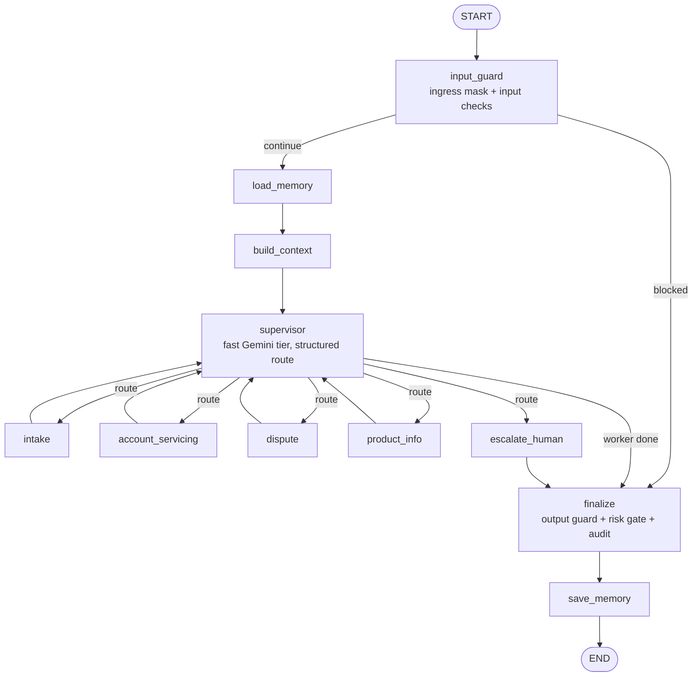
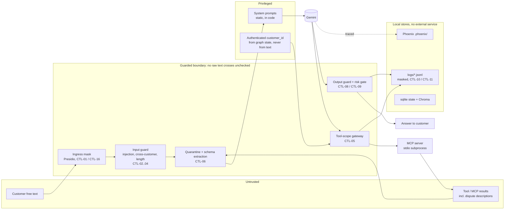
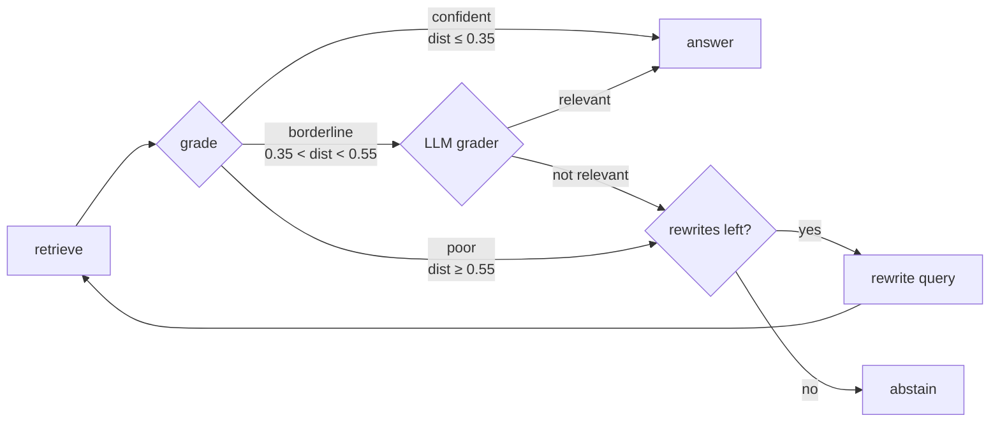

# Architecture

> Final architecture for the Banking Servicing & Dispute-Resolution Copilot
> (BC-AAIE-HACK-01). Everything below names code that exists in this
> repository; control IDs (`CTL-xx`) refer to `docs/control-catalog.md`.

## 1. Graph overview

- **Typed state:** `CopilotState` (`src/state.py`); structured-output schemas
  (`RouteDecision` etc.) in `src/schemas.py`, used at node boundaries.
- **Conditional edges:** `route_after_input_guard` (blocked input skips
  straight to `finalize`) and `route_from_supervisor` (any unknown route falls
  back to `escalate_human`) in `src/graph.py` / `src/agents/supervisor.py`.
- **Loop guards:** a soft `step_count`/`max_steps` check in the supervisor
  (CTL-14) and LangGraph's hard `recursion_limit` (CTL-15); `_invoke_turn` in
  `src/cli.py` turns a `GraphRecursionError` into a safe escalation.
- **Checkpointer:** `AsyncSqliteSaver` (`open_checkpointer`), so a thread
  resumes across turns.
- `input_guard` and `finalize` are always wired in (security is not opt-in).
  `load_memory` / `build_context` / `save_memory` are only added when a
  `memory_store` is passed to `build_graph()` (real CLI use); without one the
  graph is `START -> input_guard -> supervisor -> ... -> finalize -> END`.

### Workers

| Node | Purpose | Tools it calls |
|---|---|---|
| `intake` | Ask one focused clarifying question for an ambiguous request (AC-04); no tools | none |
| `account_servicing` | Balance, transactions, statement summary, simple service requests (AC-01) | `get_account_balance`, `list_recent_transactions`, `get_statement_summary`, `submit_service_request` |
| `dispute` | Capture a dispute, check eligibility, look up status, draft a case for a human (AC-02); always `requires_human_review=True` (CTL-25) | `check_dispute_eligibility`, `get_dispute_status`, `create_dispute_case`, `policy_search` |
| `product_info` | Answer fee/product/policy questions from the corpus with a citation, or abstain (AC-03) | `policy_search` |
| `escalate_human` | Deterministic hand-off for out-of-scope or high-risk requests | none |

## 2. Trust boundaries

| Boundary | Rule | Enforced by |
|---|---|---|
| Customer text -> graph | PANs / account numbers / PII masked before anything else sees the text; injection, cross-customer references and over-long input are blocked with a safe refusal | `sanitize_ingress`, `evaluate_input` (CTL-01..04) |
| Customer text -> prompts | Raw text is never interpolated into a system prompt; it is wrapped in `<untrusted_customer_text>` and a schema-constrained extraction pulls out only typed fields | `src/context/quarantine.py` (CTL-06) |
| Model -> tools | The customer id in a tool call must equal the authenticated id from state; a mismatch is denied and audited | `scope_denial` in `src/tools/gateway.py` (CTL-05) |
| Model -> customer | Leaked PAN/account/other-customer ids masked; refund or dispute-outcome promises rewritten; system-prompt leaks replaced; high-risk output gated to a human | `sanitize_output`, `classify_and_gate` (CTL-08, CTL-09) |
| Everything -> logs | Customer id hashed in the audit trail; PANs masked in every logger | `hash_customer_ref`, `src/common/masking.py` (CTL-07, CTL-10) |
| Long-term memory | Messages are masked before LangMem's extractor sees them (it writes to the store directly, bypassing our masking layer) | `save_memory_node` (see section 6) |

Memory poisoning and tool-result injection are residual risks, not fully
closed; they are recorded in `docs/risk-register.md` with their mitigations.

## 3. Tool and MCP layout

The custom MCP server (`mcp_server/server.py`, MCP Python SDK `FastMCP`,
stdio transport) is started as a subprocess by `src/mcp_client.py` and
consumed through `langchain-mcp-adapters`. Every request/response is written
to `logs/mcp_transcript.jsonl`.

| Kind | Name | Notes |
|---|---|---|
| MCP tool | `get_account_balance` | masked account refs |
| MCP tool | `list_recent_transactions` | |
| MCP tool | `get_statement_summary` | |
| MCP tool | `create_dispute_case` | draft only: never commits money movement |
| MCP tool | `get_dispute_status` | added after FA-02 (`docs/failure-analysis.md`) |
| MCP tool | `check_dispute_eligibility` | deterministic, driven by the resource below |
| MCP tool | `submit_service_request` | |
| MCP resource | `bank://reference/dispute-windows` | eligibility windows per dispute reason |
| Local tool | `policy_search` | agentic-RAG subgraph (`src/tools/rag_tool.py`), a real `BaseTool` so it is traced |

All eight tools reach the graph through one registry, `build_tools` in
`src/tools/registry.py`, which wraps each in the resilience wrapper
(timeout/retry -> structured failure, CTL-12) and the logging middleware
(`logs/tool_calls.jsonl`, CTL-11). No tool call can bypass either.

## 4. Models and versions

- **Provider:** Google Gemini only. Defaults in `src/config.py`:
  `GEMINI_MODEL=gemini-3.5-flash` (workers), `GEMINI_MODEL_FAST=gemini-3.5-flash-lite`
  (supervisor), `GEMINI_JUDGE_MODEL` (evaluation judge, defaults to
  `GEMINI_MODEL`). Free-tier daily quotas forced some runs onto other Gemini
  models: the Phase 5 evaluation ran worker and judge on `gemini-3.1-flash-lite`
  (recorded in `reports/eval_report.json` metadata). ref-doc requires Gemini,
  not a specific version.
- **Library versions** (pinned in `requirements.txt`, Python 3.12): langgraph 1.2.11,
  langchain-core 1.6.3, langchain-google-genai 4.4.0, langchain-mcp-adapters
  0.3.2, mcp 1.30.0, langmem 0.0.30, chromadb 1.5.9, sentence-transformers
  6.1.0, arize-phoenix 14.6.0, deepeval 4.2.3, presidio-analyzer 2.2.364, pytest 9.1.1, fastapi 0.141.1, uvicorn 0.53.0, httpx 0.28.1. `arize-phoenix` is
  pinned to 14.6.0 because 14.7+ pulls in a dependency that upgrades `mcp` to
  2.x and breaks `mcp_server/server.py`. Guardrails are policy functions plus
  Presidio; Guardrails-AI and LLM Guard are not used.

## 5. Observability and evaluation plane

Phoenix tracing is started on the run path (`init_tracing`, CTL-20) and
every turn is stamped with a `run_id` (`traced_run`, CTL-21) so documents can
cite it. Spans export to `traces/phoenix_spans.parquet`; golden signals
(latency split thinking/acting/tool, tokens, cost, accuracy, hallucination
rate) are computed by `src/observability/golden_signals.py` (CTL-24); the
DeepEval harness (`src/evaluation/harness.py`, CTL-23) scores the golden set
with a Gemini judge.

## 5a. Streaming API (optional bonus)

A backend HTTP endpoint, not a web UI: `python -m src.api` serves
`POST /chat/stream` (server-sent events for one customer turn) and
`GET /health` (liveness, no model call). It builds the same compiled graph as
the CLI, so the input guard, output guard, risk gate, tool-scope gateway,
tracing and audit apply unchanged (`src/api/app.py`, `src/api/streaming.py`).

| Event | Content |
|---|---|
| `start` | `run_id`, `thread_id` and the AI disclosure (CTL-26) |
| `progress` | `{"node": <name>}` as each graph node finishes |
| `error` | Only on failure: a fixed error type, never an exception string |
| `final` | The answer after the output guard and risk gate |

Design decisions:

- **Only node names stream mid-turn, never node content.** A worker draft has
  not yet passed `finalize`'s output guard and human-review gate, so streaming
  it would bypass them.
- **Thread ids are prefixed with the customer id**, so a client-chosen thread id
  cannot load another customer's checkpointed history.
- **Failures degrade to a safe, escalated `final` answer** (recursion limit,
  per-turn timeout, any other error), as the CLI does.
- **No authentication.** The endpoint trusts the `customer_id` it is given, like
  the CLI's `--customer-id`, and binds to loopback by default
  (`docs/security-approach.md`).

`scripts/demo_api.py` drives it end to end; the committed run is
`logs/api_demo.log`.

## 6. Memory tiers (§7.1 Tiered memory)

| Tier | Backing | Module | Scope |
|---|---|---|---|
| Short-term (thread) | LangGraph `AsyncSqliteSaver` checkpointer | `src/memory/short_term.py`, `src/graph.py::open_checkpointer` | One conversation thread |
| Long-term (semantic) | LangGraph `AsyncSqliteStore` + LangMem (Gemini) | `src/memory/long_term.py` | One customer, across every thread/session |

Both persist to `STATE_DIR` (default `data/state/`, gitignored):
`checkpoints.sqlite` and `memory.sqlite`. No external DB service (§3.4).

Long-term memory's semantic search uses a local Sentence-Transformers model
(`src/common/embeddings.py`, `all-MiniLM-L6-v2`, 384 dims), shared with the RAG
index so only one copy of the embedding weights is loaded. **First run
downloads this model** (~90MB) from Hugging Face — expect a one-time delay.

Cross-session recall flow: `load_memory_node` calls `recall()` with the
latest user message as the query; `build_context_node` folds the results into
`state["context"]["memories"]`; each worker calls `memory_context_block()` to
surface them in its LLM prompt. At the end of a turn, `save_memory_node` runs
the real LangMem extractor (`build_extractor`) over the turn's messages —
**masked first** (`mask_text`), since LangMem writes straight to the store via
its own internal call, bypassing `mask_obj()` (verified against a real
extraction run, not assumed — see the `long_term.py` commit body for detail).

## 7. Context-engineering strategies (§7.1 Context engineering)

| Strategy | Module | What it does |
|---|---|---|
| Write | `src/context/write.py` | Persists a durable note into a customer's long-term namespace |
| Select | `src/context/select.py` | Picks recent turns + recalled memories + tool results that fit a token budget (char-based estimate), recency-prioritized |
| Compress | `src/context/compress.py` | Caps list length / string length in a tool result before it enters a prompt |
| Isolate | `src/context/isolate.py` | Each worker only reads its allowlisted state slice (`isolate_for_worker`) — real, not theoretical: every worker node calls it |
| Summarize | `src/context/summarization.py` | Replaces the older part of a long conversation with one LLM-produced summary once it exceeds a token threshold; only runs when actually needed |
| Quarantine | `src/context/quarantine.py` | Raw customer text is sanitized (control chars stripped, length-capped), wrapped in a `<untrusted_customer_text>` delimiter, and never interpolated into a system prompt; a schema-constrained extraction step then pulls out only typed fields (no field for injected instructions to land in) |

## 8. Agentic-RAG (§7.1 Agentic-RAG tool)

`src/tools/rag_index.py` chunks `data/policy_corpus/*.md` by `##` heading into
deterministic chunk ids (`{doc_id}::{section-slug}`), embeds them (same local
model as above) and persists to a Chroma collection at `data/chroma/`
(gitignored, rebuild with `python scripts/build_policy_index.py`).

`src/tools/rag_tool.py` is a compiled LangGraph subgraph, not a single
retrieve-then-answer call:

Thresholds (0.35 confident / 0.55 poor) are calibrated against a real build of
the corpus, not guessed: "overdraft fee" scores ~0.13, "cryptocurrency
wallets" scores ~0.66. Most queries never need an LLM call just to be graded.
