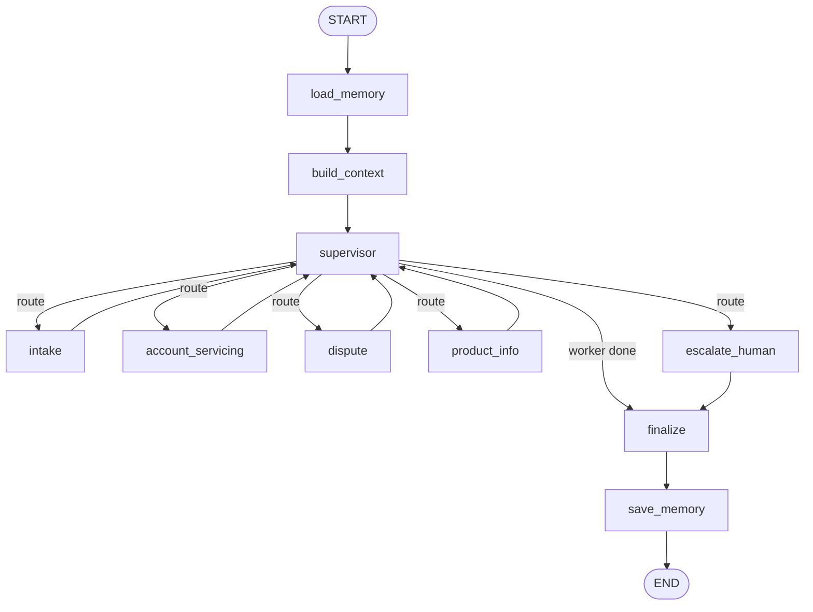
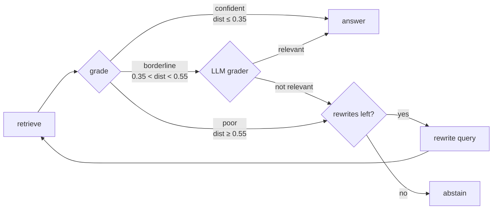

# Architecture (Phase 2 snapshot)

> Living document — Phase 6 finalizes this with trust boundaries and the full
> tool/MCP layout. This version covers what exists through Phase 2: the graph
> with memory/context nodes, the policy index, and the tiered-memory design.

## 1. Graph overview

`load_memory`/`build_context`/`save_memory` are only added when a
`memory_store` is supplied to `build_graph()` (real CLI usage); tests that
don't need memory build a graph identical to Phase 1's (`START -> supervisor
... finalize -> END`) — see `src/graph.py`.

## 2. Memory tiers (§7.1 Tiered memory)

| Tier | Backing | Module | Scope |
|---|---|---|---|
| Short-term (thread) | LangGraph `AsyncSqliteSaver` checkpointer | `src/memory/short_term.py`, `src/graph.py::open_checkpointer` | One conversation thread |
| Long-term (semantic) | LangGraph `AsyncSqliteStore` + LangMem (Gemini) | `src/memory/long_term.py` | One customer, across every thread/session |

Both persist to `STATE_DIR` (default `data/state/`, gitignored):
`checkpoints.sqlite` and `memory.sqlite`. No external DB service (§3.4).

Long-term memory's semantic search uses a local Sentence-Transformers model
(`src/common/embeddings.py`, `all-MiniLM-L6-v2`, 384 dims), shared with the RAG
index so only one copy of the embedding weights is loaded. **First run
downloads this model** (~90MB) from Hugging Face — expect a one-time delay.

Cross-session recall flow: `load_memory_node` calls `recall()` with the
latest user message as the query; `build_context_node` folds the results into
`state["context"]["memories"]`; each worker calls `memory_context_block()` to
surface them in its LLM prompt. At the end of a turn, `save_memory_node` runs
the real LangMem extractor (`build_extractor`) over the turn's messages —
**masked first** (`mask_text`), since LangMem writes straight to the store via
its own internal call, bypassing `mask_obj()` (verified against a real
extraction run, not assumed — see the `long_term.py` commit body for detail).

## 3. Context-engineering strategies (§7.1 Context engineering)

| Strategy | Module | What it does |
|---|---|---|
| Write | `src/context/write.py` | Persists a durable note into a customer's long-term namespace |
| Select | `src/context/select.py` | Picks recent turns + recalled memories + tool results that fit a token budget (char-based estimate), recency-prioritized |
| Compress | `src/context/compress.py` | Caps list length / string length in a tool result before it enters a prompt |
| Isolate | `src/context/isolate.py` | Each worker only reads its allowlisted state slice (`isolate_for_worker`) — real, not theoretical: every worker node calls it |
| Summarize | `src/context/summarization.py` | Replaces the older part of a long conversation with one LLM-produced summary once it exceeds a token threshold; only runs when actually needed |
| Quarantine | `src/context/quarantine.py` | Raw customer text is sanitized (control chars stripped, length-capped), wrapped in a `<untrusted_customer_text>` delimiter, and never interpolated into a system prompt; a schema-constrained extraction step then pulls out only typed fields (no field for injected instructions to land in) |

## 4. Agentic-RAG (§7.1 Agentic-RAG tool)

`src/tools/rag_index.py` chunks `data/policy_corpus/*.md` by `##` heading into
deterministic chunk ids (`{doc_id}::{section-slug}`), embeds them (same local
model as above) and persists to a Chroma collection at `data/chroma/`
(gitignored, rebuild with `python scripts/build_policy_index.py`).

`src/tools/rag_tool.py` is a compiled LangGraph subgraph, not a single
retrieve-then-answer call:

Thresholds (0.35 confident / 0.55 poor) are calibrated against a real build of
the corpus, not guessed: "overdraft fee" scores ~0.13, "cryptocurrency
wallets" scores ~0.66. Most queries never need an LLM call just to be graded.

## 5. What's next

- Phase 3 adds Arize Phoenix tracing across this whole graph, a tool-invocation
  log, and a trace export.
- Phase 4 adds input/output guardrails and an audit trail — including the
  explicit refusal for cross-customer requests noted as a known gap in
  `STATUS.md` (currently structurally safe by construction, but not yet an
  explicit refusal message).
- Phase 6 finalizes this document with trust boundaries and the full tool/MCP
  layout.
